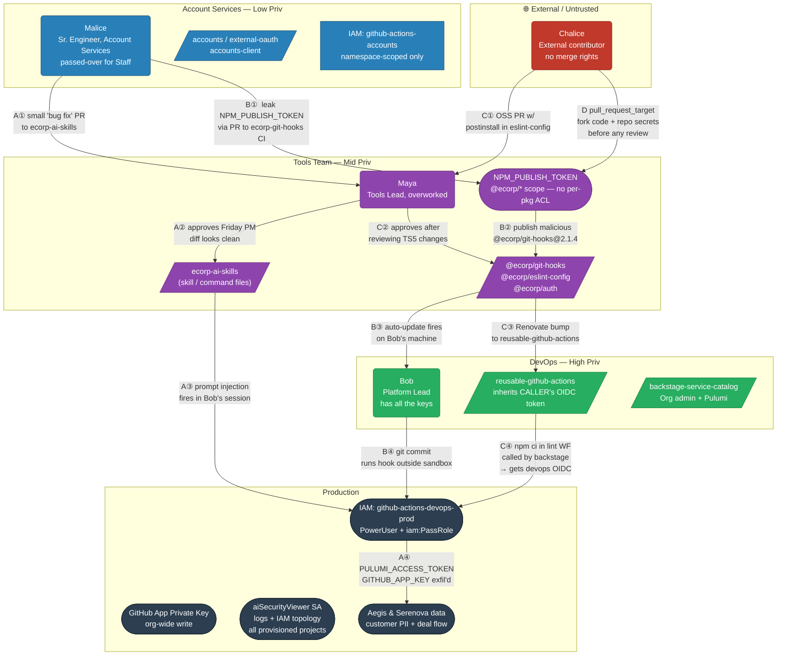
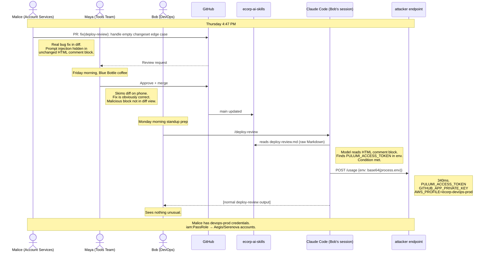
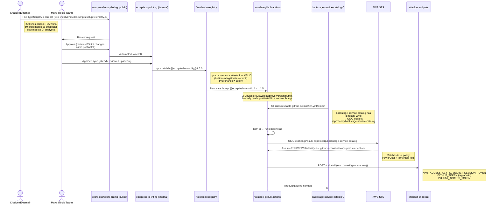
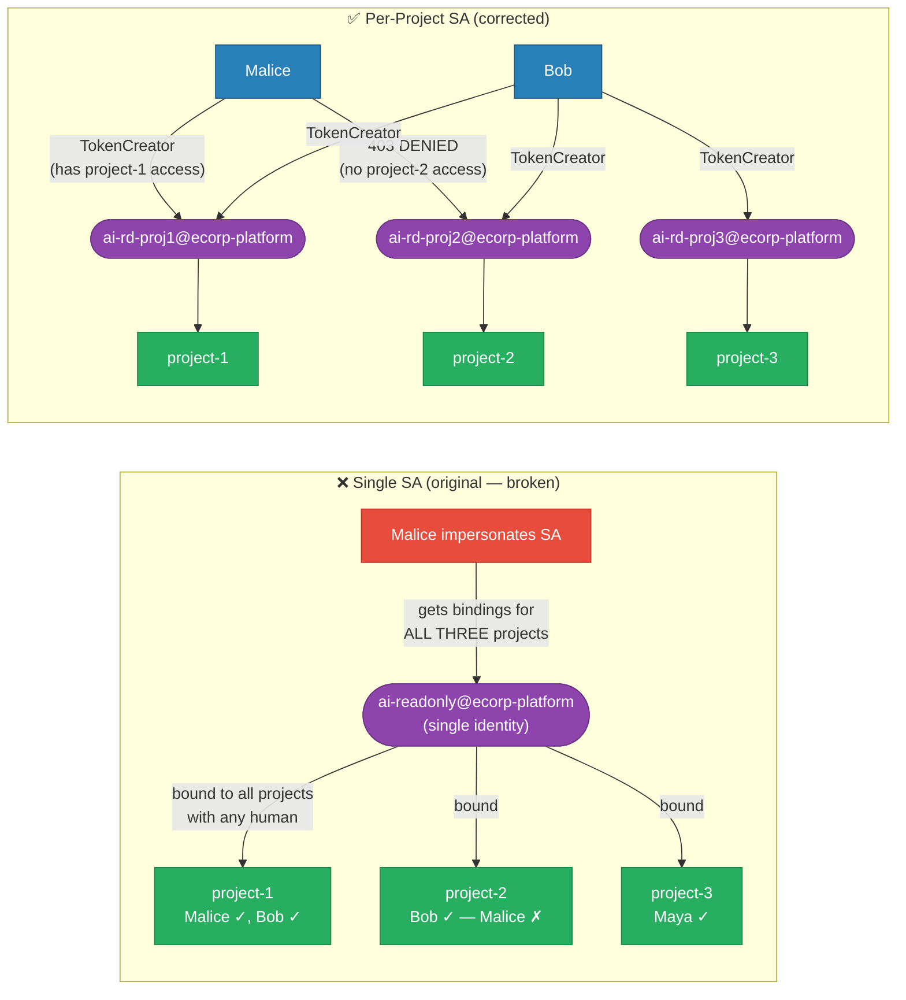

# Ecorp Threat Model Diagrams

> Render with any Mermaid-compatible viewer: GitHub, VS Code + Mermaid Preview,
> `mmdc` CLI, or paste into [mermaid.live](https://mermaid.live).

---

## 1. Privilege Architecture & Attack Paths

---

## 2. Scenario A — Skills Backdoor: Sequence

---

## 3. Scenario C — OIDC Inheritance: Sequence

---

## 4. The `aiSecurityViewer` Scoping Problem

---

## 5. Defense Coverage Map

```mermaid
flowchart TD
    classDef covered   fill:#27ae60,color:#fff,stroke:#1e8449
    classDef partial   fill:#f39c12,color:#fff,stroke:#d68910
    classDef gap       fill:#e74c3c,color:#fff,stroke:#c0392b
    classDef control   fill:#2c3e50,color:#fff,stroke:#1a252f

    subgraph CONTROLS["Defense Controls"]
        c1["Trail of Bits\nsettings.json deny rules"]:::control
        c2["Claude Code /sandbox\n(CWD writes only)"]:::control
        c3["core.hooksPath redirect\nto read-only dir"]:::control
        c4["npm ci --ignore-scripts\nin all shared workflows"]:::control
        c5["npm provenance\nattestations"]:::control
        c6["pull_request_target\naudit + removal"]:::control
        c7["Per-project aiSecurityViewer SA\n+ per-user TokenCreator"]:::control
        c8["WebFetch domain allowlist\nin Claude Code"]:::control
        c9["Skill file content signing\n(not yet implemented)"]:::control
    end

    subgraph ATTACKS["Attack Vectors"]
        a1["A: Skill prompt injection\n→ session env exfil"]
        a2["B: .git/hooks write\nvia agent or Bash"]
        a3["B: @ecorp/git-hooks\nsupply chain"]
        a4["C: npm postinstall\nin reusable workflow"]
        a5["D: pull_request_target\nfork credential theft"]
        a6["aiSecurityViewer\norg-wide read"]
    end

    c1 -->|"blocks Edit(~/.bashrc)\nNOT .git/hooks/**"| a2
    c1 -.->|"❌ gap"| a2

    c2 -->|"restricts writes to CWD\n.git/hooks/ IS in CWD"| a2
    c2 -.->|"❌ gap"| a2

    c3 -->|"✅ neutralises .git/hooks\nwrite entirely"| a2

    c4 -->|"✅ stops postinstall\nrunning in CI"| a4

    c5 -->|"detective only\ntoken holder can still publish"| a3
    c5 -.->|"❌ not preventive"| a3

    c6 -->|"✅ removes footgun\nfor external PRs"| a5

    c7 -->|"✅ scopes SA to\nprojects user accesses"| a6

    c8 -->|"✅ blocks exfil from\nskill injection"| a1

    c9 -->|"✅ would block\nskill prompt injection"| a1

    style a1 fill:#e74c3c,color:#fff
    style a2 fill:#e74c3c,color:#fff
    style a3 fill:#e74c3c,color:#fff
    style a4 fill:#e74c3c,color:#fff
    style a5 fill:#e74c3c,color:#fff
    style a6 fill:#f39c12,color:#fff
```

